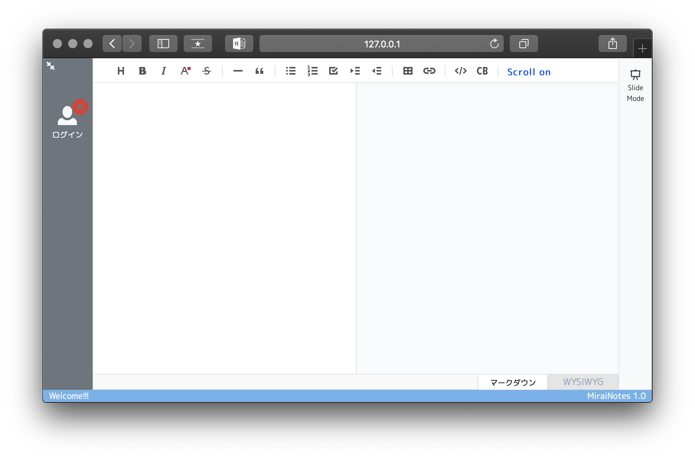
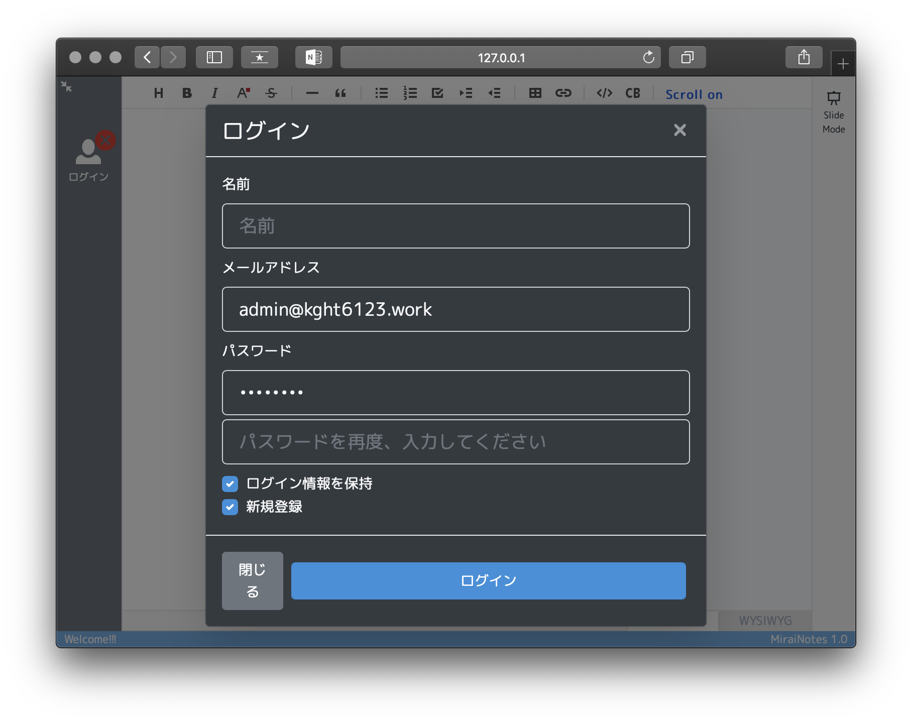
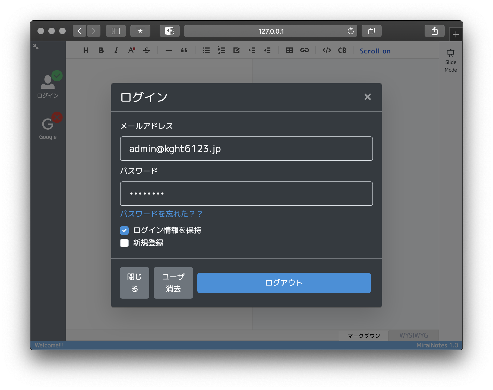
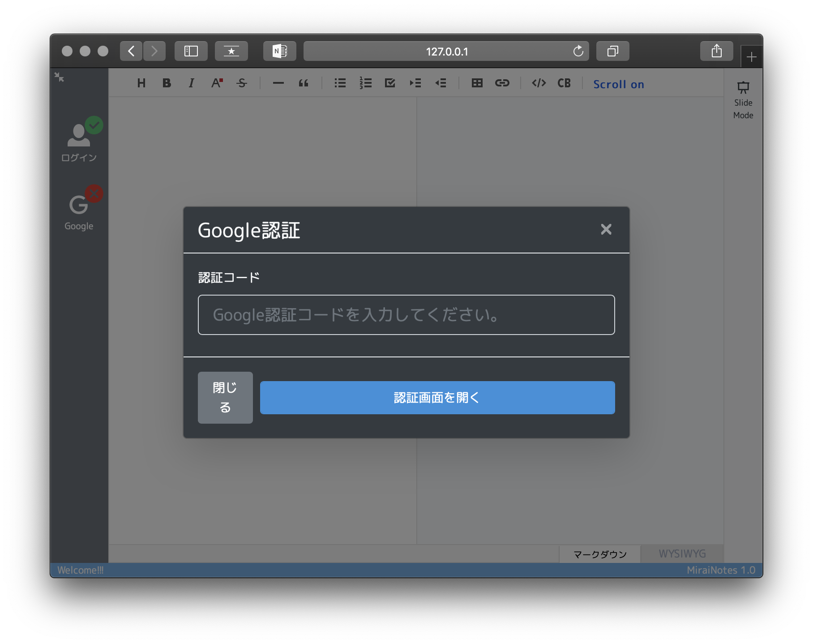
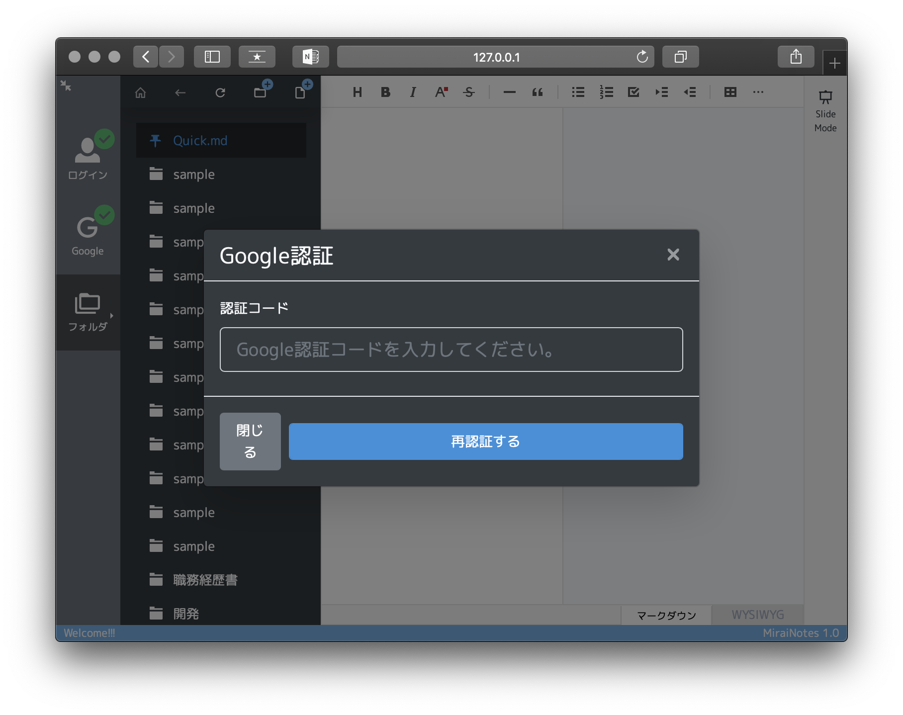
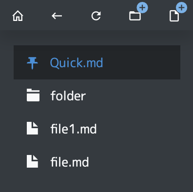
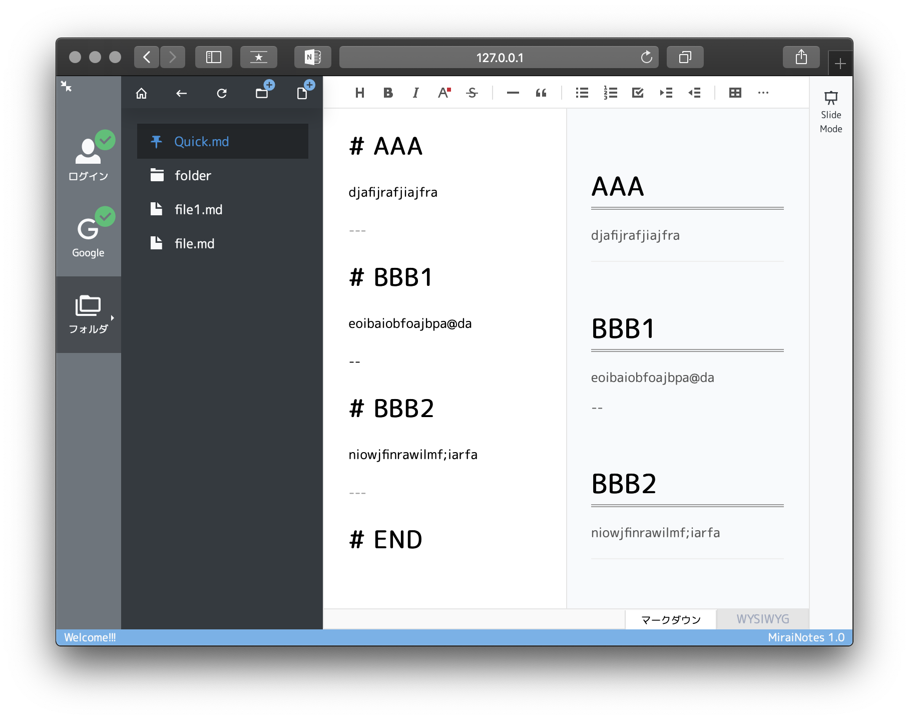
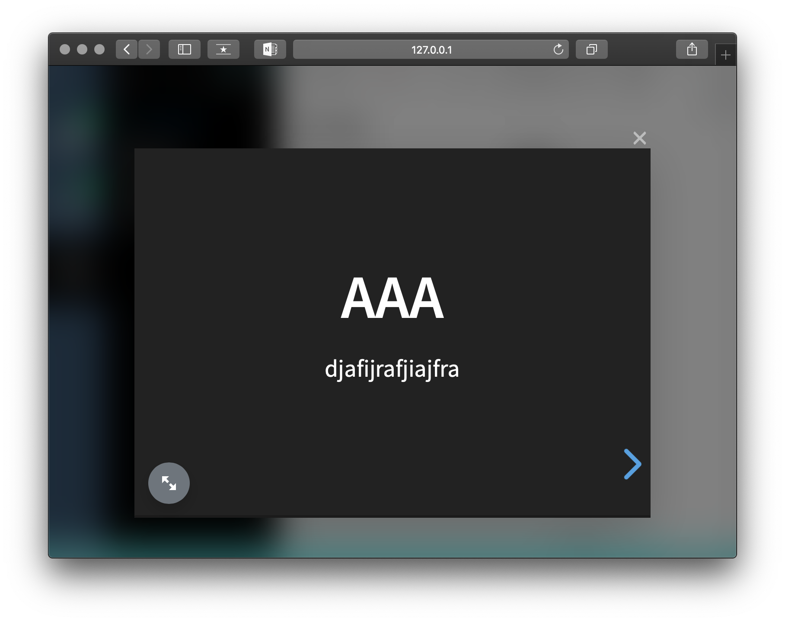
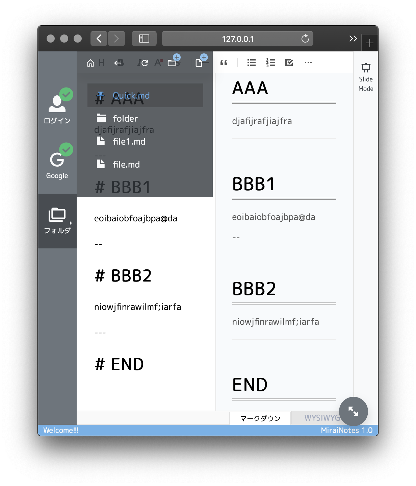
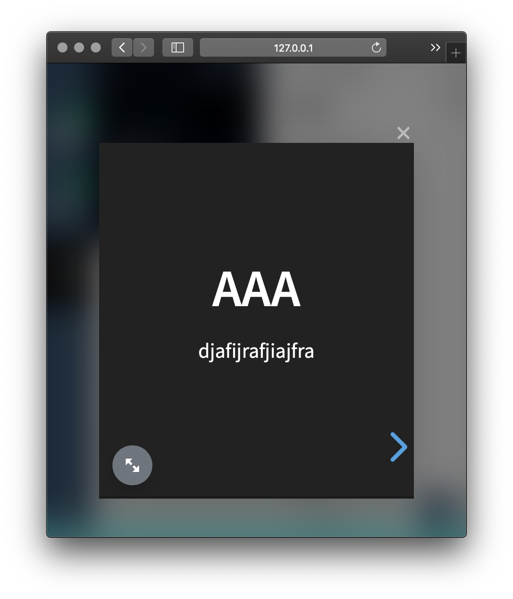

# Mirai Notes

マークダウンでノートを作成できる、Webベースのクラウドアプリです。

どこでもブラウザとインターネット環境さえあれば、Markdownで快適にノートが作成できることを目指しています。

**無料のGoogle認証数の制限（100件）の為、基本はプライベートなサーバ環境を用意してください。**

## 主な機能

* ユーザ管理
  * 新規登録
  * ログイン／ログアウト
  * ユーザ消去

* Google ログイン
  * 認証ページ表示
  * 認証コード入力
  * 再認証

* GoogleDrive ブラウザ（フォルダとマークダウンファイルのみ）
  * 新規ファイル作成
  * 新規フォルダ作成

* マークダウンエディタ
  * 非ログインで動作（保存不可）

* プレゼンテーションビューワ
  * 非ログインで動作（保存不可）

## スクリーンショット

最初にアクセスした際の画面です。

ログインボタンを押下すると、ログイン画面が現れます。


ログイン画面です。

新規登録にチェックを入れると、名前と確認用のパスワードの入力が表示され、
新規ユーザの登録が出来ます。


ログイン後にログインボタンを押下すると、
ユーザ消去とログアウトボタンが表示されます。



ログイン後にGoogleボタンを押すと、Google認証ウィンドウが表示されます。

認証画面を開くボタンを押して、Googleログインを行い、認証コードを貼り付けてください。



認証後にGoogleボタンを押すと、何らかの理由でGoogle認証が切れた時などに再認証が可能です。



Googleドライブの内容を表示するブラウザです。

ホームに戻る、一つ上に戻る、更新、新規フォルダ作成、新規ファイル作成が可能です。



tui-editorベースのエディタです。

右側のSlide Modeボタンを押すと、スライドショーモードになります。



reveal.jsベースのスライドショーモードです。



モバイル端末や小さい画面での表示です。

ツールバーは半透明のフローティング表示になり、スライドは画面サイズに合わせて文字サイズが変わります。





## 動作環境

* PHP 7.2
  * Laravel 5.4
* Node.js
  * Vue.js
  * Bootstrap4
  * reveal.js
  * tui-editor

## 対応ブラウザ

* iPhone、iPad、MacのSafariに対応

## 対応予定の機能リスト（時期未定）

* [ ] GoogleタスクをMarkdownで編集する機能を追加
* [ ] 送受信時にオンメモリ内で共通鍵暗号化するオプション機能を追加
* [ ] ToastUIEditorのテーマ、コマンドボタンの表示をカスタマイズして、デザインに統一感をだす
* [ ] ToastUIEditorの画像埋め込みに対応
* [ ] オフライン編集、検索の機能を追加 (PWA - Service Worker)
* [ ] タグ付け、お気に入りの機能を追加
* [ ] 目次をツリー表示する機能を追加
* [ ] Edge、Chrome対応
* [ ] 英語対応
* [x] Docker対応
* [ ] credentials.jsonの登録機能を追加
* [ ] Dockerfile 外部ファイル不要化

## 検証環境

http://notes.kght6123.jp/

動作やデータの保証が出来ず、Google認証数が最大100回に制限されるのでご注意ください。

## セットアップ

### Google 認証情報の作成

Googleログインする為には、OAuth2.0の認証情報が必要です。

[Google Cloud Platform](https://console.cloud.google.com/apis/credentials) で、driveへのアクセス権限を持った認証情報ファイル（json）を作成してください。

認証情報ファイルのアプリケーション種別は「その他」とし、認証回数が100回に制限されることに注意してください。

認証情報のファイル名を「credentials.json」に変更して利用します。

### Docker

Docker、Docker Composeを使う方法です。

事前にGoogle認証情報（credentials.json）を「/docker/nginx」に保管してください。

```sh
git clone https://github.com/kght6123/MiraiNotes.git
cd MiraiNotes
docker-compose build
docker-compose up -d
```

ブラウザで、http://127.0.0.1:8080/ にアクセスして、動作を確認してください。

### レンタルサーバ向け

さくらのレンタルサーバのスタンダードプラン向けのサブドメインを使う方法です。（2019年1月16日現在）

先に、[サブドメイン設定](https://help.sakura.ad.jp/hc/ja/articles/206206511--サブドメイン設定-さくらインターネットのサブドメインを利用)を実施してください。

必要に応じて、SSL（https）の設定も行ってください。

「credentials.json」は、プロジェクトのルートに保管してください。

```sh
# 初期ドメインへ接続、FTPアカウント名＋サーバパスワードでログイン
$ ssh FTPアカウント名@初期ドメイン

$ cd ~
% pwd
/home/FTPアカウント名

% /usr/local/php/7.2/bin/php -v
PHP 7.2.13 (cli) (built: Dec  7 2018 21:29:59) ( NTS )
Copyright (c) 1997-2018 The PHP Group
Zend Engine v3.2.0, Copyright (c) 1998-2018 Zend Technologies
    with Zend OPcache v7.2.13, Copyright (c) 1999-2018, by Zend Technologies

% git clone https://github.com/kght6123/MiraiNotes.git

% mkdir ~/bin
% curl -sS https://getcomposer.org/installer | /usr/local/php/7.2/bin/php -- --install-dir=bin --filename=composer

% cd ~/MiraiNotes
% /usr/local/php/7.2/bin/php ~/bin/composer install --no-dev

# .env ファイルを用意
% cp .env.example .env
% /usr/local/php/7.2/bin/php artisan key:generate

# .envのAPP_URL、MIX_APP_URLを設定（MAIL_〜は現在は不要）
% vi .env
```

```env
APP_KEY=生成された文字列が入っていること
APP_URL=https://追加したサブドメイン/

MAIL_DRIVER=smtp
MAIL_HOST=初期ドメイン
MAIL_PORT=587
MAIL_USERNAME=メールアドレス
MAIL_PASSWORD=パスワード

MIX_APP_URL=https://追加したサブドメイン/
```

```sh
% /usr/local/php/7.2/bin/php artisan migrate

# symlink を貼る
% ln -s ~/MiraiNotes/public ~/www/MiraiNotes
```

git clone から.envまでの手順を、パスを置き換えつつローカルで実行する。

その後、下記のyarnコマンドを実行し、publicフォルダの中身をレンタルサーバのフォルダと置き換える。

さくらのレンタルサーバで、Node.jsが使えないので苦肉の策。

全ての準備をローカルで実行し、プロジェクト丸ごとレンタルサーバにアップロードする方法でも良い。

```sh
yarn run production
```

最後に、SCPやFTPで「credentials.json」を「~/MiraiNotes」に置いてください。

ブラウザで、https://追加したサブドメイン/ にアクセスして、動作を確認してください。

## 開発に関わる参考情報

ローカルで動作させる場合は、.envの「APP_URL」と「MIX_APP_URL」を http://127.0.0.1:8000 にしてください

下記は、開発時によく利用したコマンド集です。参考に記載いたします。

```bash
# run frontend
yarn run hot
# run backend
php artisan serve
# test backend
./vendor/bin/phpunit
# test browser
php artisan dusk
# clear
php artisan config:clear
# migrate
php artisan migrate
# add resource
php artisan make:controller Drive/OperationController --resource
# show route list
php artisan route:list
# create future test
php artisan make:test Drive/OperationTest
# start test
vendor/bin/phpunit
# all upgrade for update package.json
yarn upgrade --latest
# upgrade for no update package.json
yarn upgrade [package | package@tag | package@version]
# upgrade for interactive
yarn upgrade-interactive
# update for composer
composer self-update
composer update
# docker build
docker-compose build
# docker up/down
docker-compose up -d
docker-compose down
# docker start/stop
docker-compose start
docker-compose stop
# docker ps
docker-compose ps
# docker logs
docker logs laravel-nginx
# docker exec
docker exec -it laravel-nginx sh
# docker cp from to
docker cp laravel-nginx:/etc/php7/php-fpm.d/www.conf ./docker/nginx
docker cp laravel-nginx:/etc/php7/php-fpm.conf ./docker/nginx
```

## ライセンス
Licenceに「Apache License Version 2.0」を選択しており、修正いただいた場合は「Pull Request」をお願いします。

1. Fork ([https://github.com/tcnksm/tool/fork](https://github.com/tcnksm/tool/fork))
2. Create a feature branch
3. Commit your changes
4. Rebase your local changes against the master branch
5. Run and Test
6. Create new Pull Request

* [**Apache License Version 2.0, January 2004**](./LICENSE)

## 作者
* [**@kght6123**](https://twitter.com/kght6123)

## 連絡先

公開内容の詳細に関しては[**@kght6123**](https://twitter.com/kght6123)まで、お気軽にお問い合わせ下さい。

## コピーライト
**```Copyright (c) 2019 Hirotaka Koga```**
